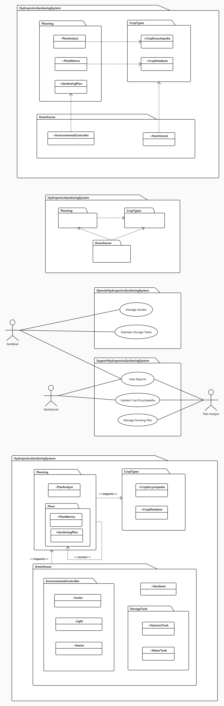
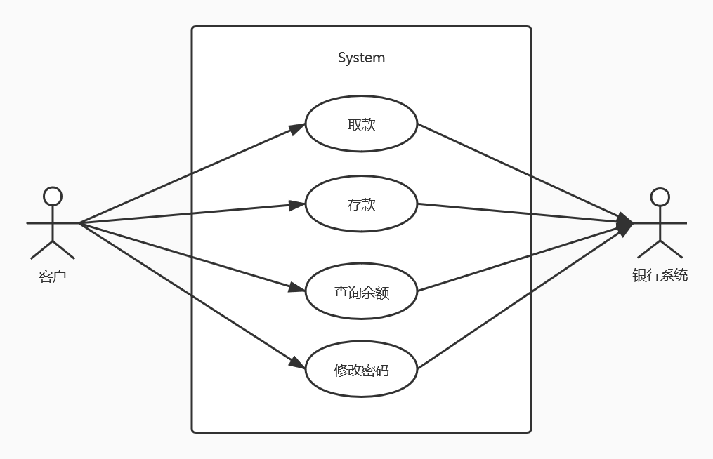

# UML图和其他图

参考书目：
- 《面向对象分析与设计》
- 《编程的逻辑-如何用面向对象的方法实现复杂业务需求》
- 《需求分析与系统设计》

## 包图

导入是一种共有的包导入；访问是一种私有的包导入。

导入和访问的区分可以让我们通过限定名称引用其它命名空间的公有元素。

包元素的导入可以是广泛或集中的，即导入所有元素或者只导入选定的元素。

## 组件图
组件图的组件包含关键词标签`<<component>>`和分类器矩形框右上角显示的组件图标。

组件图中接口定义了组件交互的细节，接口显示为小球和球窝的样子。提供接口的一方使用小球，请求接口使用球窝表示。

端口和接口不一定是一对一的关系，端口可以用来对接口分组。

组件的内部结构可以通过内部结构图表示。子系统的内部结构图可以用`<<subsystem>>`表示。

## 部署图
部署图用于展示在系统的物理设计中，工件在节点上分布的情况。单张部署视图代表了一种系统工件结构的视图。在开发中，我们使用部署图来说明节点的物理集合，这些节点是系统执行的平台。

部署图有三个基本元素：工件、节点和它们的连接。

可执行程序与依赖的组件之间用`<<manifest>>`标签连接，意味着它是这个组件的物理实现，连接起来实现与设计。

节点是一种计算资源，通常包含存储盒处理能力，工件部署在它上面执行。节点可以包含其他结点，以表示复杂的执行能力，这种情况是通过嵌套或利用组合关系来体现的。

节点有两种类型：
- 设备：一个提供了计算能力的硬件，如一台计算机、一个调制解调器或者一个传感器。
- 执行环境：一种用于部署特定类型的执行工件的软件，常以一个设备为宿主，如`<<database>>`、`<<J2EE server>>`。

节点之间会通过消息和信号进行通信，可通过一条实线来表示通信路径，可以是单向的或是双向的。每条通信路径可以包含一个可选的关键词标签，如`<<http>>`或`<<TCP/IP>>`，它提供了连接有关的信息，也可以为通信路径连接的节点指定多重性。

## 用例图

用例：
- 描述系统行为，所有用例都直接或间接的对某一个或几个参与者相关联。
- 是参与者从外部（outwardly）可以看到的业务功能，完整的功能单元。
- 用例定义主题所提供的行为，而不需要引用主题的内部结构。
- 在很多情况下，一个功能性需求可以直接映射（Map）到一个用例。
- 用例驱动整个软件开发的生命周期，是大多数开发活动的焦点和参照。
- 在UML中使用椭圆表示，名字放在椭圆的里面或下面。

参与者：
- 主题外部的人或事物针对用例所扮演的角色，即与用例进行交互的人或事物。
    - 参与者并不是某人或者某事的特定实例，而是描述一类角色（人、事物）。
    - 参与者通过诸如交换信号和数据的方式与主题交流信息，接收有用的结果。
- 在UML中使用“木头人”表示参与者，名字放在图标下侧，具有属性和操作。

`<<include>>`和`<<extend>>`是两种主要用于组织用例模型的关系，这些关系常在用例之间：
- 当一个用例被另一个用例执行时，它在用例规格说明中就体现为一个包含点，包含点指明了在外层用例的什么位置执行被包含的实例。

## 类图

类间关系：
- 关联（Association）：用关联线表示。
- 聚合（Aggregation）：关联的一种形式，用一端带有钻石装饰的关联线（聚合：`◇`，复合：`◆`）。
- 泛化（Generalization）：关联的一种形式，用带有大的空三角形的实现表示泛化，大的空三角形附在超类一端。

## 顺序图
- 水平维度：角色（对象、类、接口等）。
- 垂直维度：消息序列，显示消息的顺序。
- 垂直虚线：对象的生命线。
- 垂直的高矩形：激活（或执行规格说明execution specification），- 在生命线上被激活的方法。
- 箭头：表示一条消息，从调用对象发给被调用对象，每条消息实际是被调用对象的一个方法。
- 星号：迭代标记，标记在消息标签前，表示在收集上的迭代。

## 交互概述图(活动图+交互图)
交互概述图中的主要元素是框、控制流元素和交互图元素。

交互概述图中的控制流是由活动图元素的组合来实现的，提供了可选路径和并行路径：
- 可选路径控制是由判断节点的组合来实现的，控制流在判断节点选择合适的路径，对应的合并结点(如果需要)将所有可选路径重新会聚在一起。
- 并行路径控制是通过组合分叉节点和结合节点来实现的，分叉节点将控制流分成并行的路径，结合节点将并行的路径会聚在一起。来自所有路径的控制必须到达结合节点，控制流才能继续下去。如果存在交互约束条件可能导致一条路径阻塞，一定要有另一条可选路径能让控制流继续下去。

活动图：
- 活动图描述哪些步骤可以顺序执行、哪些步骤可以并行执行，显示计算的步骤。
- 本质是带有并发功能的程序流程图。
- 活动图显示连接动作和其他节点(如决策、分叉、连接、合并和对象节点)的流。
    - 分支(branch)及合并(merge)：产生可选(alternative)的计算线程（thread)。
    - 分叉(fork/bifurcation)及交汇(rejoin/intersection)：产生并发(co-current/parallel)的计算线程从一个动作到下一个动作控制的流程称为控制流。
- 结构
    - 实心圆`●`表示活动的开始
    - 钻石框`◆`表示分支条件，出口由事件（如Yes，No）或守卫条件（如[green light]）控制
    - 短线`－`表示流的分叉或连接
    - 牛眼`◉`表示活动的结束

## 组合结构图
组合结合图提供了一种手段来描述结构化类元及其内部结构的定义。这种内部结构是由部件及其相互连接构成的，他们都处于这个组合结构的命名空间之内。结构化类元可以嵌套，所以其中的部分可以是另一个结构化类元。除了表示组件之外，结构化类元也可以表示一个类。

组合结构图在设计时有用，可以将类分解为组成部分，并对它们在运行时刻的协作进行建模。

## 状态机图
状态机图用于设计和理解时间关键的系统，它将行为表示为一系列的状态转换，由事件触发，并与可能发生的动作相关联。

状态机图常用于描述单个对象的行为，但是它们也可以用于描述系统中更大元素的行为（复杂系统中选择抽象的层次与观察者的意图有关）。

状态机图与活动图有关，但状态机图关注的是状态以及状态之间的转换，而不是活动的流程。

并非每个类都有重要的、时序性的行为，所以只为表现出这些行为的类提供状态机图即可。

- 状态图描述某一个类或一个对象不同状态的改变。
- 状态图是状态和由事件引起的转换的偶图。
- 状态图是业务规则模型（在一段时期内是保持不变的，相对独立于特定的用例）。
- 状态图组成元素
    - 实心圆`●`：表示活动的开始
    - 圆角矩形：一个状态
    - 箭头`→`：状态的转换
    - 转换语言：`Event (parameters) [guards] / action`
    - 守卫和事件的区别：在事件的处理点上估算守卫条件来决定是否将被触发
    - 牛眼`◉`：表示活动的结束

## 时间图
时间图是一种交互图，其目的是展示元素状态随时间的变化，以及事件如何改变这些状态。

时间图的一般布局是从时间上追溯与它并列的一个序列图。

时间图中可以包含约束。

不只是事件可以导致状态改变，像消息等其他刺激物也可以导致状态改变。

消息和事件都可以用在UML图中，目的是清楚地表达设计者的意图。

## 对象图
对象图用于说明系统的逻辑设计中存在的对象以及对象之间的关系。换言之，对象图代表了时间上的一张快照，记录了一组特定配置的对象上的瞬时事件流。因此，对象图是原型化的——每张对象图都代表了结构上的关系，这些关系可能发生在一组给定的类实例上。单张对象图代表了系统对象结构的一张视图。

在分析过程中，对象图常用于说明主要场景和次要场景的语义，提供对系统行为的跟踪。 
在设计过程中，对象图常用于说明逻辑系统设计中各种机制的语义。 
不论在哪个阶段，对象图都能提供一些具体的例子，帮助实现关联类图的可视化。

对象图的两个基本元素是对象和它们之间的关系。

对象的名称可以采用下面三种格式之一：
- `objectName` : 只有对象名
- `:ClassName` : 只有类名
- `objectName :ClassName` : 对象名和类名

两个对象之间有关联则表明，两个类的实例之间存在着一条通信路径（即链接），一个对象可以通过它向另一个发送消息。 
所有的类都隐式地有到自己的关联，因此对象可以向自己发送消息。

## 通信图
通信图在UML2.0以前被称为协作图，是一种类型的交互图，它关注对象在参与具体的交互时，对象之间如何链接以及传递什么消息。

一般来说，消息的发出者知道接收者，但接收者不一定知道发出者。

可以通过一条或多条消息来修饰一个链接。通过一条指向目标对象的有向线段，可以说明消息的方向。操作调用是最常见的一种消息类型（另一种是信号），它可以包含实际的参数，这些参数与操作的签名相符。
