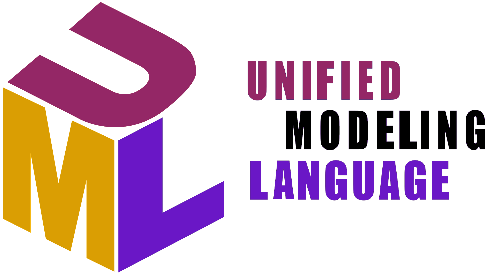

# UML

UML是一种为面向对象开发系统的产品进行说明、可视化、和编制文档的标准语言。

UML作为一种模型语言，它使开发人员专注于建立产品的模型和结构，而不是选用什么程序语言和算法实现。UML不是一种编程语言，但工具可用于生成各种语言的代码中使用UML图。

UML并不是一个方法学，也不要求使用一个方法学，但是UML对于Rational统一过程来说是必不可少的。

UML系统开发中有三个主要的模型：
- 功能模型：从用户的角度展示系统的功能，包括用例图
- 对象模型：采用对象，属性，操作，关联等概念展示系统的结构和基础，包括类图、对象图
- 动态模型：展现系统的内部行为，包括序列图、活动图、状态图

UML元素：
- 基本模块：
    - 事物(Things)：UML模型中最基本的构成元素，是具有代表性的成分的静态抽象
        - 结构事物：
            - 类(Class)：具有相同属性、方法、关系和语义的对象的集合
            - 接口(Interface)：类或组件所提供的服务(操作)，描述了类或组件对外可见的动作
            - 协作(Collaboration)：元素之间的相互作用
            - 用例(Use Case)：执行者(在系统外部和系统交互的人)和被考虑的系统之间的交互来实现的一个业务目标
            - 组件(Component)：物理系统的一部分，存在于运行阶段
            - 节点(Node)：运行时存在的物理元素
        - 行为事物：模型里随着时空不断变化的部分
            - 交互(Interaction)：一种行为，包括一组元素之间的消息交换来完成特定的任务
            - 状态机(State Machine)：由一系列对象的状态组成
        - 分组事物：可以分解模型的容器
            - 包(Package)：可收集结构和行为，结构事物、动作事物甚至分组事物都有可能放在一个包中，只存在于开发阶段
        - 注释事物：捕捉UML模型元素的言论、说明和注释
            - 注释(Annotation)：渲染意见、约束等UML元素
    - 关系(Relationships)：关系把事物紧密联系在一起
        - 依赖：两件事物之间的语义联系，其中一个事物的变化也影响到另一个事物
        - 关联(协作)：一组对象之间连接的结构关系，如聚合关系(描述了整体和部分间的结构关系)
        - 实现
        - 泛化：一种一般化-特殊化的关系，描述了对象世界中的继承关系
    - 图(Diagrams)：图是事物和关系的可视化表示
        - [用例图](#用例图)：从用户的角度出发描述系统的功能、需求，展示系统外部的各类角色与系统内部的各种用例之间的关系
        - [类图](#类图)：描述系统所包含的类、类的内部结构及类之间的关系
        - [对象图](#对象图)：类图的一个具体实例
        - [包图](#包图)：描述的模型中的包及其包含的元素组合
        - [部署图](#部署图)：定义系统中软硬件的物理体系结构
        - [活动图](#活动图)：描述系统中各种活动的执行顺序
        - [状态图](#状态图)：描述一类对象的所有可能的状态以及事件发生时状态的转移条件
        - [序列图](#序列图)：表示对象之间动态合作的关系
        - [协作图](#协作图)：描述对象之间的协作关系
        - [组件图](#组件图)：描述代码部件的物理结构以及各部件之间的依赖关系

UML特点：
- 面向对象
- 可视化，表达能力强
- 独立于过程
- 独立于程序设计
- 容易掌握使用

UML的作用：
- 为软件系统建立可视化模型
- 为软件系统建立构件 
- 为软件系统建立文档

参考书目：
- 《面向对象分析与设计》
- 《编程的逻辑-如何用面向对象的方法实现复杂业务需求》
- 《需求分析与系统设计》

## UML图

- [用例图](#用例图)
- [类图](#类图)
- [对象图](#对象图)
- [包图](#包图)
- [部署图](#部署图)
- [活动图](#活动图)
- [状态图](#状态图)
- [序列图](#序列图)
- [协作图](#协作图)
- [组件图](#组件图)

### 用例图

用例图描述角色以及角色与用例之间的连接关系，说明是谁要使用系统，以及他们使用该系统可以做些什么。

一个用例图包含了多个模型元素，如系统、参与者和用例，并且显示了这些元素之间的各种关系，如泛化、关联和依赖。

用例：
- 描述系统行为，所有用例都直接或间接的对某一个或几个参与者相关联
- 是参与者从外部可以看到的业务功能，完整的功能单元
- 用例定义主题所提供的行为，而不需要引用主题的内部结构
- 在很多情况下，一个功能性需求可以直接映射到一个用例
- 用例驱动整个软件开发的生命周期，是大多数开发活动的焦点和参照
- 在UML中使用椭圆表示，名字放在椭圆的里面或下面

参与者：
- 主题外部的人或事物针对用例所扮演的角色，即与用例进行交互的人或事物
    - 参与者并不是某人或者某事的特定实例，而是描述一类角色（人、事物）
    - 参与者通过诸如交换信号和数据的方式与主题交流信息，接收有用的结果
- 在UML中使用“木头人”表示参与者，名字放在图标下侧，具有属性和操作

`<<include>>`和`<<extend>>`是两种主要用于组织用例模型的关系，这些关系常在用例之间： 
当一个用例被另一个用例执行时，它在用例规格说明中就体现为一个包含点，包含点指明了在外层用例的什么位置执行被包含的实例。

**[⬆ top](#uml)**

### 类图

类图是描述系统中的类，表示类、接口和它们之间的协作关系，以及各个类之间的关系的静态视图，能够让我们在正确编写代码以前对系统有一个全面的认识。

类图是一种静态模型类型。

类间关系：
- 关联(Association)：用关联线表示
- 聚合(Aggregation)：关联的一种形式，用一端带有钻石装饰的关联线(聚合：`◇`，复合：`◆`)
- 泛化(Generalization)：关联的一种形式，用带有大的空三角形的实现表示泛化，大的空三角形附在超类一端

**[⬆ top](#uml)**

### 对象图

对象图与类图极为相似，是类图的实例。对象图显示类的多个对象实例，而不是实际的类，它描述的不是类之间的关系，而是对象之间的关系。

对象图用于说明系统的逻辑设计中存在的对象以及对象之间的关系。换言之，对象图代表了时间上的一张快照，记录了一组特定配置的对象上的瞬时事件流。因此，对象图是原型化的——每张对象图都代表了结构上的关系，这些关系可能发生在一组给定的类实例上。单张对象图代表了系统对象结构的一张视图。

在分析过程中，对象图常用于说明主要场景和次要场景的语义，提供对系统行为的跟踪。 
在设计过程中，对象图常用于说明逻辑系统设计中各种机制的语义。 
不论在哪个阶段，对象图都能提供一些具体的例子，帮助实现关联类图的可视化。

对象图的两个基本元素是对象和它们之间的关系。

对象的名称可以采用下面三种格式之一：
- `objectName` : 只有对象名
- `:ClassName` : 只有类名
- `objectName :ClassName` : 对象名和类名

两个对象之间有关联则表明，两个类的实例之间存在着一条通信路径(即链接)，一个对象可以通过它向另一个发送消息。 
所有的类都隐式地有到自己的关联，因此对象可以向自己发送消息。

**[⬆ top](#uml)**

### 包图

导入是一种共有的包导入；访问是一种私有的包导入。

导入和访问的区分可以让我们通过限定名称引用其它命名空间的公有元素。

包元素的导入可以是广泛或集中的，即导入所有元素或者只导入选定的元素。

**[⬆ top](#uml)**

### 部署图

部署图建模系统的物理部署，用于展示在系统的物理设计中工件在节点上分布的情况。例如，计算机和设备，以及它们之间是如何连接的。

部署图用于表示一组物理节点的集合及节点间的相互关系，从而建立了系统物理层面的模型。

单张部署视图代表了一种系统工件结构的视图。

在开发中，可以使用部署图来说明节点的物理集合，这些节点是系统执行的平台。

部署图的使用者是开发人员、系统集成人员和测试人员。

部署图有三个基本元素：工件、节点和它们的连接。

可执行程序与依赖的组件之间用`<<manifest>>`标签连接，意味着它是这个组件的物理实现，连接起来实现与设计。

节点是一种计算资源，通常包含存储盒处理能力，工件部署在它上面执行。节点可以包含其他结点，以表示复杂的执行能力，这种情况是通过嵌套或利用组合关系来体现的。

节点有两种类型：
- 设备：一个提供了计算能力的硬件，如一台计算机、一个调制解调器或者一个传感器。
- 执行环境：一种用于部署特定类型的执行工件的软件，常以一个设备为宿主，如`<<database>>`、`<<J2EE server>>`。

节点之间会通过消息和信号进行通信，可通过一条实线来表示通信路径，可以是单向的或是双向的。每条通信路径可以包含一个可选的关键词标签，如`<<http>>`或`<<TCP/IP>>`，它提供了连接有关的信息，也可以为通信路径连接的节点指定多重性。

**[⬆ top](#uml)**

### 活动图

活动图描述用例要求所要进行的活动，以及活动间的约束关系，有利于识别并行活动。

活动图本质是带有并发功能的程序流程图，描述哪些步骤可以顺序执行、哪些步骤可以并行执行，并显示计算的步骤。

活动图能够演示出系统中哪些地方存在功能，以及这些功能和系统中其他组件的功能如何共同满足前面使用用例图建模的商务需求。

活动图显示连接动作和其他节点(如决策、分叉、连接、合并和对象节点)的流。
- 分支(branch)及合并(merge)：产生可选的计算线程。
- 分叉(fork/bifurcation)及交汇(rejoin/intersection)：产生并发的计算线程从一个动作到下一个动作控制的流程称为控制流。

活动图的结构：
- 实心圆`●`表示活动的开始
- 钻石框`◆`表示分支条件，出口由事件(如Yes，No)或守卫条件(如[green light])控制
- 短线`－`表示流的分叉或连接
- 牛眼`◉`表示活动的结束

**[⬆ top](#uml)**

### 状态图

状态图用于设计和理解时间关键的系统，它将行为表示为一系列的状态转换，由事件触发，并与可能发生的动作相关联。

状态图描述类的对象所有可能的状态，以及事件(如消息的接收、时间的流逝、错误、条件变为真等)发生时状态的转移条件，可以捕获对象、子系统和系统的生命周期。

状态图常用于描述单个对象的行为，也可以用于描述系统中更大元素的行为(复杂系统中选择抽象的层次与观察者的意图有关)。

状态图与活动图有关，但状态图关注的是状态以及状态之间的转换，而不是活动的流程。

状态图描述某一个类或一个对象不同状态的改变，是对类图的补充。并非每个类都有重要的、时序性的行为，这时只为表现出这些行为的类提供状态图即可。一个状态图应该连接到所有具有清晰的可标识状态和复杂行为的类，状态图可以确定类的行为，以及该行为如何根据当前的状态变化，也可以展示哪些事件将会改变类的对象的状态。

状态图是状态和由事件引起的转换的偶图。

状态图是业务规则模型(在一段时期内是保持不变的，相对独立于特定的用例)。

状态图组成元素：
- 实心圆`●`：表示活动的开始
- 圆角矩形：一个状态
- 箭头`→`：状态的转换
- 转换语言：`Event (parameters) [guards] / action`
- 守卫和事件的区别：在事件的处理点上估算守卫条件来决定是否将被触发
- 牛眼`◉`：表示活动的结束

**[⬆ top](#uml)**

### 序列图

序列图是用来显示参与者如何以一系列顺序的步骤与系统的对象交互的模型，可以用来展示对象之间是如何进行交互的。

序列图将显示的重点放在消息序列上，即强调消息是如何在对象之间被发送和接收的。

序列图要素：
- 水平维度：角色(对象、类、接口等)
- 垂直维度：消息序列，显示消息的顺序
- 垂直虚线：对象的生命线
- 垂直的高矩形：激活(或执行规格说明)，在生命线上被激活的方法
- 箭头：表示一条消息，从调用对象发给被调用对象，每条消息实际是被调用对象的一个方法
- 星号：迭代标记，标记在消息标签前，表示在收集上的迭代

**[⬆ top](#uml)**

### 协作图

通信图在UML2.0以前被称为协作图，是一种类型的交互图，它关注对象在参与具体的交互时，对象之间如何链接以及传递什么消息。一般来说，消息的发出者知道接收者，但接收者不一定知道发出者。

通信图(协作图)可以通过一条或多条消息来修饰一个链接。通过一条指向目标对象的有向线段，可以说明消息的方向。

操作调用是最常见的一种消息类型(另一种是信号)，它可以包含实际的参数，这些参数与操作的签名相符。

协作图可以看作类图和序列图的交集，协作图建模对象或者角色，以及它们彼此之间是如何通信的。

协作图和序列图相似，用于显示对象间的动态合作关系，序列图和协作图合称为交互图。如果强调时间和顺序，则使用序列图；如果强调上下级关系，则选择协作图。

交互图中的主要元素是框、控制流元素和交互图元素。

交互图中的控制流是由活动图元素的组合来实现的，提供了可选路径和并行路径：
- 可选路径控制是由判断节点的组合来实现的，控制流在判断节点选择合适的路径，对应的合并结点(如果需要)将所有可选路径重新会聚在一起
- 并行路径控制是通过组合分叉节点和结合节点来实现的，分叉节点将控制流分成并行的路径，结合节点将并行的路径会聚在一起。来自所有路径的控制必须到达结合节点，控制流才能继续下去。如果存在交互约束条件可能导致一条路径阻塞，一定要有另一条可选路径能让控制流继续下去

**[⬆ top](#uml)**

### 组件图

组件图描述代码组件的物理结构以及各种组件之间的依赖关系，建模软件的组件及其相互之间的关系，由组件标记符和组件之间的关系构成。

在组件图，组件是软件单个组成部分，它可以是一个文件，产品、可执行文件和脚本等。

组件图的组件包含关键词标签`<<component>>`和分类器矩形框右上角显示的组件图标。

组件图中接口定义了组件交互的细节，接口显示为小球和球窝的样子。提供接口的一方使用小球，请求接口使用球窝表示。端口和接口不一定是一对一的关系，端口可以用来对接口分组。

组件的内部结构可以通过内部结构图表示。子系统的内部结构图可以用`<<subsystem>>`表示。

**[⬆ top](#uml)**
